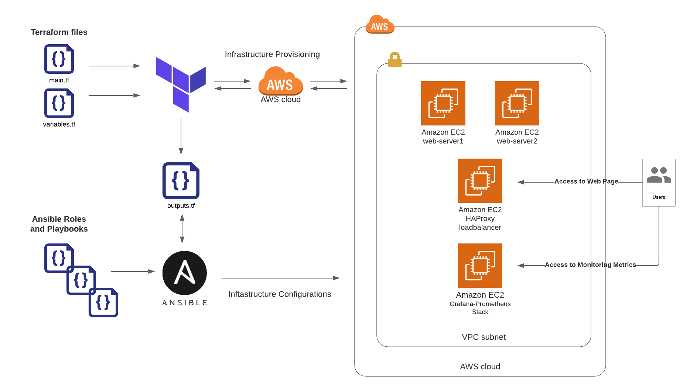

### LoadBalanced-WebSite
Provision a load-balanced static HTML page whose metrics are collected by Prometheus &amp; illustrated by Grafana on AWS using Terraform and Ansible.

### Requirements
----------------

| Name | Version | Notes |
|------|---------|---------|
| <a name="requirement_terraform"></a> [terraform](#requirement\_terraform) | >= 0.12 |
| <a name="requirement_ansible"></a> [ansible](#requirement\_ansible) | >= 2.9 |
| <a name="requirement_ansible_community"></a> [ansible community.grafana collection ](#requirement\_requirement_ansible_community) | >= 1.2.1 | To install it use: `ansible-galaxy collection install community.grafana`

### Tested on

The role was tested in the following distributions on AWS.

| Distribution                | Tested             |
| --------------------------- |:------------------:|
| Ubuntu 20.04  | :white_check_mark: |


### Usage
----------

#### Quickstart

- You need to have access to your AWS Account
- Edit variables.tf file if you need to set/edit terraform variables. All variables have default value except `aws_region` and `aws_profile`.
- Edit [grafana variable file](./ansible/roles/grafana/vars/main.yml) and set Garafana admin password
- Optionally all configuration related variables can be changed from the according role's default folder

Here is an example to provision a load-balanced static HTML page whose metrics are collected by Prometheus &amp; illustrated by Grafana on AWS using Terraform and Ansible:

```
$ terraform init
$ terraform plan
$ terraform apply
...
Apply complete! Resources: 18 added, 0 changed, 0 destroyed.

```
- After provisioning infrastructure with terraform a new `inventory file` will be created in `ansible` folder
- Use created inventory file to configure infrastructure with ansible:

```
$ ansible-playbook -i ansible/inventory ansible/site.yml

...
PLAY RECAP ***********************************************************************************************************************************************************
grafana1                   : ok=17   changed=11   unreachable=0    failed=0    skipped=0    rescued=0    ignored=0
loadbalancer1              : ok=31   changed=19   unreachable=0    failed=0    skipped=5    rescued=0    ignored=0
web_server1                : ok=19   changed=16   unreachable=0    failed=0    skipped=1    rescued=0    ignored=0
web_server2                : ok=19   changed=16   unreachable=0    failed=0    skipped=1    rescued=0    ignored=0

```

Now we can get the IP address of `loadbalancer` and `grafana UI` from inventory file. We can just open the `./ansible/inventory` file or use bash tools like awk to get the required IP addresses:

```
$ awk '{print $1 "\t" $2}'  ./ansible/inventory

[webservers]
web_server1     ansible_host={WEB_SERVER1_IP_ADDRESS}
web_server2     ansible_host={WEB_SERVER2_IP_ADDRESS}

[loadbalancers]
loadbalancer1   ansible_host={LOAD_BALANCER_IP_ADDRESS}

[grafanaservers]
grafana1        ansible_host={GRAFANA_PROMETHEUS_STACK_IP_ADDRESS}

```

Try to access web site:
```
$ curl {LOAD_BALANCER_IP_ADDRESS}   

<html>
    <head>
        <title>Welcome to {WEB_SERVER1_IP_ADDRESS} !</title>
    </head>
    <body>
        <h1>The apache virtual is running! IP Address: {WEB_SERVER1_IP_ADDRESS}! </h1>
    </body>
</html>%


$ curl {LOAD_BALANCER_IP_ADDRESS}

<html>
    <head>
        <title>Welcome to {WEB_SERVER2_IP_ADDRESS}!</title>
    </head>
    <body>
        <h1>The apache virtual is running! IP Address: {WEB_SERVER2_IP_ADDRESS}</h1>
    </body>
</html>%
```
As we can see the HAProxy `roundrobin` configuration works!

In order to access Grafana UI and check dashboards and collected metrics open the grafana1 host {GRAFANA_PROMETHEUS_STACK_IP_ADDRESS} in browser and access via password which set in [grafana variable file](./ansible/roles/grafana/vars/main.yml).

There will be 1 datasource (`prometheus`) and 2 dashboards (`HAProxy and Node Exporter Full`) created.

- The `HAProxy` dashboard contains metrics from loadbalancer. The `Relative time ranges` and `Refresh dashboard` settings can be configured to see data.

- The `Node Exporter Full` dashboard contains metrics from these servers:
  
  - `loadbalancer1 ansible_host={LOAD_BALANCER_IP_ADDRESS}`
  - `web_server1 ansible_host={WEB_SERVER1_IP_ADDRESS}`
  - `web_server2 ansible_host={WEB_SERVER2_IP_ADDRESS}`

Note: A bash code can be run to create traffic on loadbalancer and monitor: 
- ```while true;do curl http://{LOAD_BALANCER_IP_ADDRESS};done```

### Architecture
----------



### Ideas for improvement
----------

- Currently generating Ansible inventory from terraform outputs is based on `local-exec` feature of terraform and I used script for that
- Currently there is no any check for AMI ID. Checking availability of the provided `ami-id` by terraform vars based on region needs to be implemented
- There is no any tests configured. Tests for ansible roles needs to be implemented
- Currently terraform exposes required ports to internet. Connections between services can be done privately. Multiple VPCs and VPC Peering needs to be implemented
- Currently there is no SSL enabled for the services. Certificates from private certificate authorities or non-profit certificate authorities like [Lets Encrypt](https://letsencrypt.org/) can be added

## Credits
----------

I've been inspired by & used the following open source projects:

* [ prometheus/haproxy_exporter ](https://github.com/prometheus/haproxy_exporter)
* [ rfrail3/grafana-dashboards ](https://github.com/rfrail3/grafana-dashboards)
